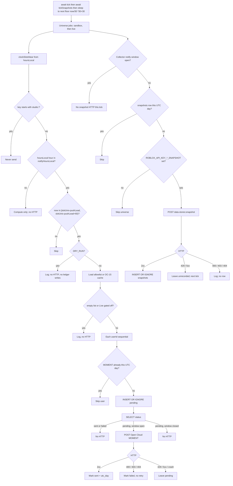

# Gachamon OpenCloud Controller — Architecture

**Status:** Draft, 2026-09-13. **v1 host is this laptop** (`npm start` + localhost dashboard, Collector + Snapshots tabs). Fly remains a later always-on option. Numbers must match [PRODUCT.md](PRODUCT.md) and [OPERATIONS.md](OPERATIONS.md). **OC-19** (not shipped): `pushLeadSeconds` 600. **OC-15** (not shipped): lot-alumni DataStore audience.

Clock source of truth is TCG, not this repo:

- `roblox_gacha/src/server/SpecialNpcDirector.server.lua` — `hash32`, `jitterFor`, `clockSlotsNear`
- `roblox_gacha/src/server/Config/NPCConfig.lua` — `COLLECTOR` hours and lead times
- Spec: `roblox_gacha/docs/COLLECTOR_OPEN_CLOUD_NOTIFICATIONS.md`

If controller and game disagree on `slotUnix`, **fix the controller**.

**Do not implement jitter from the TCG spec’s “Multiplication is mod 2^32” sentence.** Implement from `SpecialNpcDirector.hash32` and the golden table. That spec sentence is uint32 wrap (`Math.imul` → jitter **237**); the Lua is IEEE-754 multiply (jitter **433**).

---

## Cheat sheet

| Key | Value |
| --- | --- |
| `scheduleTimeZone` | `Etc/UTC` |
| Live universe / place | `6674250544` / `98219898516303` |
| Live `hoursLocal` (visit / clock) | `[16, 4]` |
| Live `notifyHoursLocal` (send) | `[16]` under `Etc/UTC` (⊆ `hoursLocal`, same zone). Brazil: `[13]` with `hoursLocal: [13, 1]` |
| Sandbox universe / place | `7034342160` / `117194948580255` |
| Sandbox `hoursLocal` (visit / clock) | `[4, 10, 16, 22]` |
| Sandbox `notifyHoursLocal` | `[4, 10, 16, 22]` — subset or arm one hour per test day |
| `jitterSeconds` | `600` |
| `pushLeadSeconds` | `480` (v1). **OC-19:** `600` |
| `sendWindowSeconds` | `60` |
| `inGameToastLeadSeconds` | `120` (game only) |
| `catchWindowSeconds` | `600` (game only) |
| `tickIntervalSeconds` | `30` (`await tick()` then `await tickSnapshots()` then sleep to next boundary; no overlap) |
| Live snapshot | 1 POST / UTC day; `universe-datastores.control:snapshot`; independent of `DRY_RUN` |
| `payload.type` | `MOMENT` |
| `analytics_data.category` | `collector_incoming` |
| `launch_data` | `collector:<slotKey>` |

Host `TZ=UTC` (set in `.env`). Two processes must compute the same `slotUnix`. v1 is **one local Node process**. Do not run two `npm start` copies against the same `./data` sqlite.

Committed `config/schedule.yaml` (intended):

```yaml
scheduleTimeZone: "Etc/UTC"
jitterSeconds: 600
pushLeadSeconds: 480     # OC-19: 600
sendWindowSeconds: 60
tickIntervalSeconds: 30
live:
  universeId: "6674250544"
  placeId: "98219898516303"
  hoursLocal: [16, 4]
  notifyHoursLocal: [16]     # ⊆ hoursLocal, same zone; Brazil would be [13]
  allowlistPath: "config/allowlist.live.json"
sandbox:
  universeId: "7034342160"
  placeId: "117194948580255"
  hoursLocal: [4, 10, 16, 22]
  notifyHoursLocal: [4, 10, 16, 22]
  allowlistPath: "config/allowlist.sandbox.json"
```

---

## High-level shape

```
npm start  (this laptop, TZ=UTC, 30s tick)
    │
    ├─ http://127.0.0.1:3848   dashboard (Collector + Snapshots)
    ├─ config/schedule.json + allowlist.*.json
    ├─ .env: ROBLOX_API_KEY_* , ROBLOX_API_KEY_*_SNAPSHOT , MESSAGE_ID_*
    │
    ├─ clock.ts          slotKey / slotUnix / pushAt
    ├─ audience.ts       v1 JSON allowlist
    ├─ store.ts          sqlite ./data/{sandbox,live}.sqlite
    ├─ snapshot.ts       1 Live DataStore snapshot / UTC day
    └─ roblox.ts         POST notifications + data-stores:snapshot
                              │
                              ▼
                     Roblox Notification Center
                     (Join → TCG place; game owns spawn)
                     + DataStore versioning pin (~30 days)
```

This service never talks to TCG remotes, ProfileStore, or MessagingService.



```mermaid
sequenceDiagram
  participant Tick
  participant Clock
  participant Store
  participant Roblox
  Tick->>Clock: now Unix UTC
  Clock-->>Tick: slots with key, slotUnix, pushAt
  Tick->>Tick: filter send window, drop studio:
  Tick->>Store: moment_days this UTC day?
  Store-->>Tick: no
  Tick->>Store: INSERT OR IGNORE pending; SELECT
  Store-->>Tick: pending and window open
  Tick->>Roblox: POST /users/{id}/notifications
  Roblox-->>Tick: 2xx
  Tick->>Store: status=sent, moment_days
```

---

## Clock contract

Internal time: **Unix seconds UTC**. Slot key: `YYYY-MM-DDTHH` **after** converting civil time in `scheduleTimeZone` to UTC. Must match TCG `clockSlotsNear`:

1. `dayOffset ∈ {-1, 0, +1}` in `scheduleTimeZone` (not the host zone).
2. For each `hoursLocal` hour, convert `(localDate, hourLocal)` → `nominalUnix` with a TZ database (luxon).
3. UTC parts of `nominalUnix` → `key = YYYY-MM-DDTHH` (zero-padded).
4. `slotUnix = nominalUnix + jitterFor(key)`.
5. Drop keys starting with `studio:`.

Default `Etc/UTC` + Live `[16, 4]` is identity with TCG `VisitHoursUtc`. A local hour can fall on a **different UTC date** (e.g. `22:00` America/Sao_Paulo → `01:00` UTC next day). The slot key uses the UTC date.

Roblox `os.time({ year, month, day, hour, min=0, sec=0, isdst=false })` treats the table as **UTC** (Sandbox Studio Edit 2026-09-10: `hour=16` → `1789056000` while the host was EDT). The controller still must not read the host offset (`Date#getHours()`, `TZ=` other than process `TZ=UTC` for logging). Inject `now` and the IANA zone.

Equivalent Live hours in Brazil: `America/Sao_Paulo` + `[13, 1]` must still yield UTC hours 16 and 4. To retarget “evening in Brazil,” change TCG `VisitHoursUtc` **first**.

Do not use a fixed offset (`UTC-3`) for DST zones. Brazil currently has no DST; still use the IANA name.

### Jitter — match Luau `hash32`, not the TCG spec sentence

**Do not implement from** `COLLECTOR_OPEN_CLOUD_NOTIFICATIONS.md` §2 “xor is 32-bit. Multiplication is mod 2^32.” That is `Math.imul` (jitter **237**). Implement from `SpecialNpcDirector.hash32` and this golden table.

`hash32` / `jitterFor` are `local` in TCG. **Do not invoke in-game `jitterFor` in Studio Play** (`jitterSeconds()` is **20** there). Paste the snippet with `span = 600`, or read logs on a **published** Sandbox server.

TCG (`SpecialNpcDirector.server.lua`):

```
h = 2166136261
for each byte of key:
    h = bit32.bxor(h, byte)
    h = (h * 16777619) % 4294967296
jitter = (h % (2 * span + 1)) - span    -- span = 600, inclusive [-600, +600]
```

`bit32.bxor` is 32-bit. The multiply is **IEEE-754 double**, then `% 2^32`. Products exceed 2^53, so this **diverges** from uint32 wrap (`Math.imul`, Python `int`, BigInt).

**Verified in TCG Sandbox Studio Edit 2026-09-10** (place `117194948580255`) by executing the same functions with `span = 600`:

| key | hash32 (Luau) | jitter s | nominalUnix | slotUnix | slot UTC | pushAt UTC |
| --- | ---: | ---: | ---: | ---: | --- | --- |
| `2026-09-10T16` | 1396388120 | **433** | 1789056000 | 1789056433 | 16:07:13Z | 15:59:13Z (v1, −480s). OC-19: **15:57:13Z** (−600s) |
| `2026-09-10T04` | 1379463408 | 213 | 1789012800 | 1789013013 | 04:03:33Z | 03:55:33Z |
| `2026-09-10T10` | 1429943360 | −267 | 1789034400 | 1789034133 | 09:55:33Z | 09:47:33Z |
| `2026-09-10T22` | 1480423312 | 454 | 1789077600 | 1789078054 | 22:07:34Z | 21:59:34Z |
| `2026-09-11T04` | 680209728 | −41 | 1789099200 | 1789099159 | 03:59:19Z | 03:51:19Z |

Textbook uint32 FNV for `2026-09-10T16` is hash `1898790244`, jitter **237**. That would miss TCG spawn by **196s**. **Do not use `Math.imul`.**

Intended TypeScript:

```ts
/** Match Luau hash32. Do not use Math.imul / BigInt. */
export function hash32(key: string): number {
  let h = 2166136261;
  for (let i = 0; i < key.length; i++) {
    h = (h ^ key.charCodeAt(i)) >>> 0;
    h = ((h * 16777619) % 4294967296) >>> 0;
  }
  return h;
}

export function jitterFor(key: string, span = 600): number {
  const s = Math.floor(span);
  if (s <= 0) return 0;
  return (hash32(key) % (2 * s + 1)) - s;
}
```

A unit test that “fixes” this to `Math.imul` must fail the golden table.

### Worked example — `2026-09-10T16`

```
span        = 600
key         = 2026-09-10T16
hash32      = 1396388120
jitter      = (1396388120 % 1201) - 600 = +433
nominalUnix = 1789056000          // 2026-09-10 16:00:00Z
slotUnix    = 1789056433          // 2026-09-10 16:07:13Z  TCG spawn
pushAt      = 1789055953          // 2026-09-10 15:59:13Z  Open Cloud
send window = [1789055953, 1789056013)   // 15:59:13–16:00:13Z
toastAt     = 1789056313          // 16:05:13Z  game only
catchEnd    = 1789057033          // 16:17:13Z  game only
```

### Send window

**One tick at a time.** `await tick()` (including every MOMENT POST) **then** `await tickSnapshots()` **then** sleep until `floor(now/30)*30+30`. Never arm the next timeout at the start of `tick` — overlapping ticks would double-POST a `pending` row. Snapshot HTTP is on the same chain so it cannot overlap MOMENT POSTs. No in-tick 429 backoff (leave `pending`; next 30s tick retries) so ticks stay short. No `sending` status in v1.

Scheduled snapshots **skip** while any Collector **notify** slot is in its 60s send window, then retry next tick. Manual dashboard snapshot does not wait. Snapshots do **not** honor `DRY_RUN` (that flag is MOMENT-only).

A slot is eligible to **send** iff the **`hoursLocal` hour used to build that slot** is in `notifyHoursLocal` **and** `now ∈ [slotUnix - pushLead, slotUnix - pushLead + 60)`. v1 `pushLead` = 480; **OC-19** = 600. `notifyHoursLocal` ⊆ `hoursLocal` in the **same** IANA zone — not a second UTC conversion, not `slotKey`’s UTC hour unless the zone is `Etc/UTC`. Visit hours still compute every TCG slot. If `pushAt` is past, **skip**. Do not send in the toast window or after spawn.

**Live `Etc/UTC` `notifyHoursLocal: [16]`** so the 1/day cap is not spent on 04:00 UTC (01:00 Brazil). TCG still spawns at 04. Brazil equivalent: `America/Sao_Paulo`, `hoursLocal: [13, 1]`, **`notifyHoursLocal: [13]`** → send only 16:00Z. Keeping `[16]` in that zone matches no generating hour → zero Live MOMENTs. Golden: after a 04:00 send, 16:00 is skipped; with notify `[16]` under `Etc/UTC`, 04:00 is computed but not sent; Sao Paulo `[13, 1]` + notify `[13]` → send only 16:00Z.

**Shared 16:00 window:** jitter hashes `slotKey` only. Live and Sandbox `2026-09-10T16` share `slotUnix` `1789056433` and the same 60s window. v1: sequential sandbox then live **inside one** `await tick()`, tens of ids. v2: time-budget sandbox (~20s) or split Fly processes if DataStore audience would burn the window.

### Host TZ independence

CI must run the same clock tests under at least:

- `TZ=UTC`
- `TZ=America/Los_Angeles`
- `TZ=Europe/Lisbon`

Assert identical `key` / `slotUnix`. Freeze DST dates `2026-03-08`, `2026-11-01` (US) and `2026-03-29`, `2026-10-25` (EU). For default `Etc/UTC` those dates must still match TCG UTC hours. Keep a helper test that converts `America/New_York` civil 16:00 on a DST and a standard date so an operator cannot switch zones silently.

---

## Stack

| Layer | Choice | Why |
| --- | --- | --- |
| Language | TypeScript, Node 22+, ESM (`tsx`) | `Number` is IEEE-754 like Luau; JSON; vitest |
| TZ | luxon | IANA; never host `Date#getHours()` |
| HTTP | `fetch` | built-in |
| Ledger | `node:sqlite`, one file per universe | unique constraint; no native addon |
| Config | `config/schedule.json` committed, no secrets | hours and ids are not secret |
| Secrets | `.env` gitignored | never GitHub Actions |
| Tests | vitest | clock tests need no network |
| Host v1 | **this laptop**: `npm start`, 30s `await tick()`, dashboard `127.0.0.1:3848` | 60s window; machine must stay awake |
| Host later | Fly.io always-on, no `[http_service]` | when we do not want a laptop up at 15:59 UTC |
| CLI | `npm start` / `npm run tick` | `tsx src/index.ts` |
| CI | GitHub Actions `npm test` (optional) | no production API keys; not the cron |

Python is viable only if every FNV multiply is `float` (not `int`). GitHub Actions: official shortest schedule is **5 minutes**, and jobs delay under load — unhittable for a 60s window. Vercel Cron is not a process clock.

v1: **one process**, two isolated MOMENT jobs per tick (sandbox then live), then the snapshot pass. **Confirmed 2026-09-10 (user)** — not two Fly processes from the start. Separate sqlite files, keys, hours, allowlists. Shared 16:00 window: sequential is fine at allowlist scale. Snapshot HTTP waits until after that window.

---

## Repo layout

```
src/
  clock.ts          hash32, jitterFor, clockSlotsNear, inSendWindow
  roblox.ts         MOMENT + DataStore snapshot client
  store.ts          node:sqlite ledger (sends, moment_days, snapshots)
  audience.ts       allowlist JSON
  worker.ts         one tick (INSERT OR IGNORE → SELECT → POST)
  snapshot.ts       daily DataStore snapshot (1/UTC day, skip send window)
  config.ts         schedule.json + .env
  server.ts         127.0.0.1 dashboard + 30s scheduler
  index.ts          npm start | npm run tick --once
public/             local dashboard (Collector + Snapshots tabs)
config/
  schedule.json
  allowlist.sandbox.json
  allowlist.live.json           # []
tests/
  clock.test.ts
  idempotency.test.ts
  snapshot.test.ts
```

```bash
npm test
npm start
npm run tick -- --universe sandbox --dry-run
```

`--dry-run` / `DRY_RUN=true`: compute and log MOMENTs, **no notification HTTP**, **no writes** to `sends` or `moment_days`. Default locally. Dry-run then live tick **must still POST**. MOMENT dry-run does not need notification keys. **`tickSnapshots` still POSTs** if `ROBLOX_API_KEY_LIVE_SNAPSHOT` (or sandbox) is set. Dashboard **Tick now** is MOMENT dry-run only and does not take a snapshot; **Take snapshot now** does.

---

## Open Cloud API

```
POST https://apis.roblox.com/cloud/v2/users/{userId}/notifications
Header: x-api-key: <per-universe key>
Header: Content-Type: application/json
```

```json
{
  "source": { "universe": "universes/7034342160" },
  "payload": {
    "message_id": "<MESSAGE_ID_SANDBOX>",
    "type": "MOMENT"
  },
  "join_experience": {
    "launch_data": "collector:2026-09-10T16"
  },
  "analytics_data": {
    "category": "collector_incoming"
  }
}
```

Live: `universes/6674250544` + `MESSAGE_ID_LIVE`. Client must refuse a send if `source.universe` ≠ job `universeId`.

| HTTP | Action |
| --- | --- |
| 2xx | ledger `sent`; write `moment_days` |
| 400 | `failed`, no retry (config bug — page) |
| 403 | `failed`, no retry (opted out / ineligible) |
| 404 | `failed`, no retry |
| 429 / 5xx / network | leave `pending`; **no in-tick sleep**; next 30s tick retries if still in window |

Concurrency v1 = **1** sequential POSTs inside one `await tick()`. Allowlist tens of ids. Do not overlap ticks.

Docs: [User notifications (Open Cloud)](https://create.roblox.com/docs/cloud/guides/experience-notifications).

### DataStore snapshot

```
POST https://apis.roblox.com/cloud/v2/universes/{universeId}/data-stores:snapshot
Header: x-api-key: <ROBLOX_API_KEY_LIVE_SNAPSHOT>
Header: Content-Type: application/json
Body: {}
```

```json
{
  "newSnapshotTaken": true,
  "latestSnapshotTime": "2026-09-12T00:05:12Z"
}
```

Scope: **`universe-datastores.control:snapshot`**. Live env `ROBLOX_API_KEY_LIVE_SNAPSHOT` (universe `6674250544` only). Optional `ROBLOX_API_KEY_SANDBOX_SNAPSHOT`. Never reuse the notifications key. Sandbox snapshot HTTP never uses universe `6674250544`.

| HTTP | Action |
| --- | --- |
| 2xx | `INSERT OR IGNORE` into `snapshots` for `(universe_id, utc_date)`. `newSnapshotTaken: false` still records the day (Roblox no-op) |
| already a row today | no HTTP |
| Collector notify window open (scheduled only) | no HTTP this tick |
| 400 / 403 / 404 | log; no row |
| 429 / 5xx / network | no row; next 30s tick retries |

Roblox: one snapshot per UTC day per experience. This is a versioning pin (~30 days), not a dump. No list-snapshots API — dashboard history is local sqlite.

Docs: [Snapshot Data Stores](https://create.roblox.com/docs/cloud/reference/DataStore#Cloud_SnapshotDataStores), [versioning](https://create.roblox.com/docs/cloud-services/data-stores/versioning-listing-and-caching#snapshots).

---

## Audience

TCG does **not** export lot alumni today. There is no `CollectorNotify` DataStore in `roblox_gacha` (spec-only). Do not invent recipients. Do not blast Notify-bell CCU.

| Stage | Source |
| --- | --- |
| v1 | `config/allowlist.sandbox.json` `{ "userIds": [...] }`. Live file `[]`. `LIVE_SENDS_ENABLED=false` |
| v2 (OC-15) | Open Cloud list of DataStore **`CollectorNotify`** **in that universe**. Key = `userId` string (**not** `lotId` — lots are reused; MOMENT is per user). Value includes `updatedUnix`. Keep ids with `updatedUnix` in the last **14 days**. Dormant alumni who join again are re-touched by TCG and re-enter the window. **Blocked on TCG-OC-02 + TCG-OC-08.** |

v1 does not check claimed-lot itself. Operators put ids on the list on purpose.

v2 list/filter happens **outside** the 60s send window (cache userIds). Fallback to allowlist if the store is missing. Empty audience ⇒ no HTTP. New key `ROBLOX_API_KEY_*_DATASTORE` (`objects:list` / `objects:read`); never reuse the notifications or snapshot key. Shared 16:00: time-budget sandbox or split processes if Live alumni POSTs would miss the window.

Released owners stay eligible for 14 days after TCG bumps `updatedUnix` on release. Current offline owners are included. `lotId` in the value is optional debug — not used to send.

---

## Data model

SQLite per universe (`/data/sandbox.sqlite`, `/data/live.sqlite`):

```sql
CREATE TABLE sends (
  universe_id  TEXT NOT NULL,
  slot_key     TEXT NOT NULL,
  user_id      INTEGER NOT NULL,
  slot_unix    INTEGER NOT NULL,
  push_at      INTEGER NOT NULL,
  status       TEXT NOT NULL,      -- pending | sent | failed
  http_status  INTEGER,
  sent_unix    INTEGER,
  error        TEXT,
  created_unix INTEGER NOT NULL,
  PRIMARY KEY (universe_id, slot_key, user_id)
);

CREATE TABLE moment_days (
  universe_id  TEXT NOT NULL,
  user_id      INTEGER NOT NULL,
  utc_date     TEXT NOT NULL,      -- YYYY-MM-DD of send, UTC
  slot_key     TEXT NOT NULL,
  PRIMARY KEY (universe_id, user_id, utc_date)
);

CREATE TABLE snapshots (
  universe_id           TEXT NOT NULL,
  utc_date              TEXT NOT NULL,      -- YYYY-MM-DD of POST, UTC
  taken_unix            INTEGER NOT NULL,
  new_snapshot_taken    INTEGER NOT NULL,   -- 1 if Roblox created a new pin
  latest_snapshot_time  TEXT,               -- Roblox RFC-3339 UTC
  http_status           INTEGER,
  error                 TEXT,
  source                TEXT NOT NULL,      -- scheduled | manual
  PRIMARY KEY (universe_id, utc_date)
);
```

**`INSERT OR IGNORE` then `SELECT`.** Unique conflict is not “already sent”:

| `SELECT status` | Window | Action |
| --- | --- | --- |
| `sent` or `failed` | any | no HTTP |
| `pending` or missing | in `[pushAt, pushAt+60)` | POST |
| `pending` | closed | no HTTP (do not send late) |

2xx → `UPDATE … SET status='sent' WHERE status='pending'` then `moment_days`. 400/403/404 → `failed` **only if still `pending`** (must not overwrite `sent`). 429/5xx/crash → leave `pending`; no in-tick backoff. Dry-run never inserts. Tests: two overlapping ticks → one HTTP; 2xx then 4xx does not overwrite `sent`.

`utc_date` is the UTC calendar date of **send time**. Enforces Roblox’s one MOMENT per user per **UTC day** (not host local). **Confirmed 2026-09-10 (user).** Live still uses `notifyHoursLocal: [16]` so 04:00 never spends that row.

`snapshots.utc_date` is the UTC calendar date of the snapshot POST. Unique `(universe_id, utc_date)`. 429/5xx do not insert, so the next tick retries. `new_snapshot_taken = 0` still counts as the day’s row (Roblox already had a snapshot that UTC day).

No `tick_log` table — stdout JSON only (MOMENT ticks plus `{ "event": "snapshot", ... }`).

Ledger growth: O(users × notify slots) plus 1 snapshot row per universe per UTC day. Tiny at allowlist scale.

---

## Hosting

**v1 is local.** `npm start` must be running and the laptop awake through `[pushAt, pushAt+60)`. Sleep/lid-close is a missed send.

The dashboard is **not** a public HTTP service. It binds `127.0.0.1` only. Tabs: **Collector** | **Snapshots**. The in-page **Tick now** button always dry-runs MOMENTs. **Take snapshot now** POSTs Open Cloud (1/UTC day).

| Option | Use? |
| --- | --- |
| **This laptop** + `npm start` + `http://127.0.0.1:3848` | **Default v1** |
| GitHub Actions | `npm test` only. Schedule floor is **5 minutes** + delay. **No** `ROBLOX_API_KEY_*` in GitHub |
| Vercel Cron | No — cold start, no process clock, 60s window |
| Fly.io always-on Machine, no `[http_service]` | Later, when we do not want a laptop up at 15:59 UTC |

**If the local process is not running at `pushAt`, that is a miss.** Fly bootstrap (when we need it) stays in [OPERATIONS.md](OPERATIONS.md).

`fly launch` defaults to `[http_service]` + autostop — **do not**. Machines without services are not proxy-autostopped. There is no `[machine]` table in fly.toml. Copy-pasteable bootstrap (app, volume, Dockerfile with `python3/make/g++` **and runtime `sqlite3`**, `fly ssh` sqlite, deploy freeze) is in [OPERATIONS.md](OPERATIONS.md).

Intended `fly.toml`:

```toml
app = "gachamon-opencloud"
primary_region = "iad"

# No [http_service]. No [[services]]. No auto_stop_machines=stop.

[env]
  TZ = "UTC"

# No [machine] table. auto_stop_machines exists only under [http_service].
# No [http_service] / [[services]] ⇒ proxy will not autostop.

[[restart]]
  policy = "always"

[[vm]]
  size = "shared-cpu-1x"
  memory = "256mb"

[mounts]
  source = "opencloud_data"
  destination = "/data"
```

Image `CMD` is `node dist/index.js` (no `[processes]` worker group — `fly deploy` targets the default process). Volume is exclusive-mount: second replica **fails closed**. Do not deploy in the **15 minutes around `pushAt`**. Single replica; do not `fly scale count` above 1.

Load: Live **1 notify** slot/day (16) + Sandbox up to 4 (1/day cap per user); tens of POSTs; sequential. Shared 16:00 window across universes.

---

## Security

- API keys and message ids **only** in Fly secrets / local `.env`. Placeholders in `.env.example`. Never log `x-api-key`. **Never in GitHub Actions.**
- Do **not** IP-allowlist Roblox keys unless a Fly **dedicated** egress IPv4 is documented (Fly shared egress is not stable; a laptop-locked key 403s from Fly).
- Job object binds `universeId` + key + allowlist. Tests: Sandbox fixture never contains `6674250544`. Rotate both keys if mixed.
- Snapshot keys are **separate** (`ROBLOX_API_KEY_LIVE_SNAPSHOT`). Live snapshot HTTP uses Live universe id only; Sandbox snapshot never uses `6674250544`.
- Live **MOMENT** HTTP requires `LIVE_SENDS_ENABLED=true` **and** a non-empty Live audience (v1 allowlist; OC-15 cached alumni or allowlist fallback). Live **snapshot** HTTP requires only the snapshot key.
- Audience DataStore keys (`ROBLOX_API_KEY_*_DATASTORE`) are **separate** from notifications and snapshot. List/read `CollectorNotify` only.
- Local dashboard binds `127.0.0.1` only. It never returns API keys. UI tick is dry-run only. Snapshot button is real HTTP.
- PII = Roblox `userId` only. Do not commit a large Live player list.

---

## Observability

One JSON log line per MOMENT tick (no secrets): `universeId`, `tickUnix`, `slotKey`, `slotUnix`, `pushAt`, `audienceN`, `sentN`, `failN`, `skipN`, `dryRun`. Snapshot lines: `{ "event": "snapshot", universeId, job, utcDate, newSnapshotTaken, latestSnapshotTime, httpStatus, source }`.

Alert (human, v1): any 400; machine down around a known `pushAt`; zero sends in an expected Sandbox window with a non-empty allowlist; Live snapshot key set but no `snapshots` row for yesterday UTC; **`fly status` stopped/suspended = P0**.

How to verify a slot against TCG: [OPERATIONS.md](OPERATIONS.md).

---

## Risks

| Risk | Sev | Mitigation |
| --- | --- | --- |
| `Math.imul` / spec “mod 2^32” desyncs notify vs spawn | High | Golden test 433 for `2026-09-10T16`; CI fails on 237 |
| Missed 60s window (`http_service` autostop, deploy) | High | No HTTP service; wall-clock 30s; deploy freeze 15 min around `pushAt`; `fly status` stopped = P0 |
| Live/Sandbox key mixup | High | Typed job; tests; rotate |
| Shared 16:00 window | Med | v1 sequential; v2 time-budget or split |
| 1/day cap on 04:00 UTC | High if unfixed | Live `notifyHoursLocal: [16]` |
| Nobody opted in (403) | Med | Expected until TCG `PromptOptIn` (What's New expires 2026-10-10; need TCG-OC-03b on claim) |
| DataStore list inside 60s window | High if unfixed | OC-15: refresh audience before `pushAt`; window is POST only |
| `CollectorNotify` keyed by lotId | High | Key is `userId`. Lots are reused; former owners would be overwritten |
| TCG changes hours without this repo | Med | Hours in YAML; compare to `NPCConfig.lua` |
| Missed UTC-day snapshot (laptop asleep all day) | Med | Same host as MOMENT; dashboard Snapshots tab; retry next tick if 429 |
| Snapshot key mixed with notifications key | High | Separate env vars; 403 = wrong scope |

---

## Alternatives (short)

- **Python 3.12 + zoneinfo:** fine if FNV uses `float` multiply. Default is TS so `Number` matches Luau by default.
- **GitHub Actions schedule:** UTC is real; **5-minute floor** + delay makes a 60s window unhittable. CI / dry-run dispatch **without** API keys only.
- **Postgres/Turso from day one:** extra vendor. SQLite + exclusive volume is enough for one Machine.
- **MessagingService fallback:** forbidden; live servers only.
- **Widen send window to 5 min:** forbidden; would enter toast window or notify late.
- **Fly start ~2 min before `pushAt`:** rejected for v1; start latency vs 60s window. Always-on ~$2/mo.
